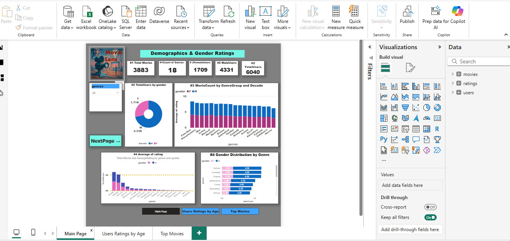
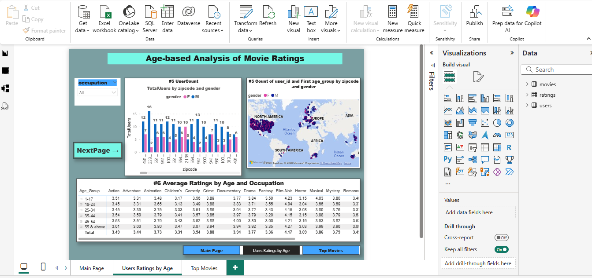
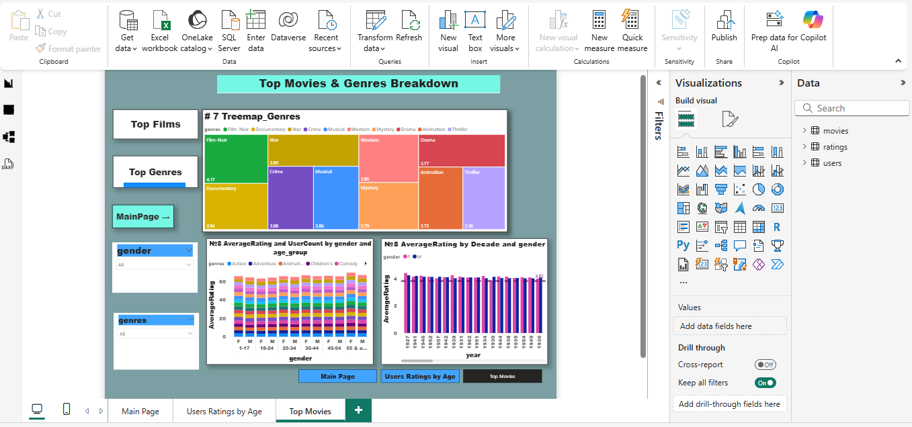
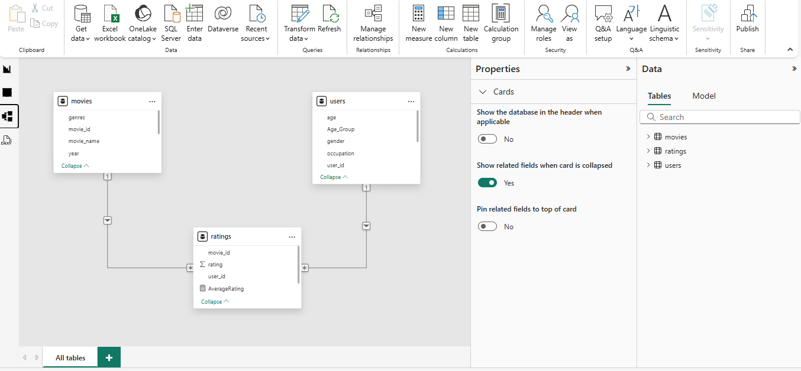
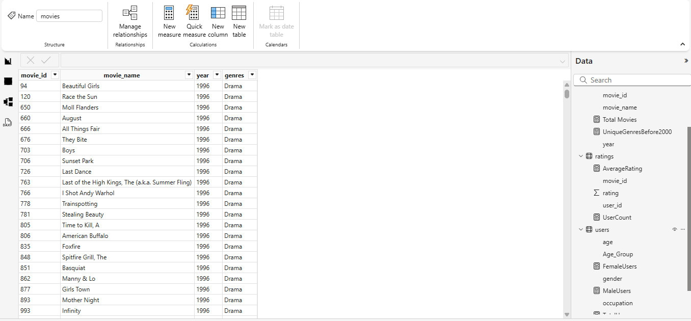

# movielens-powerbi-dashboard
This project presents an analytical dashboard built using Power BI to explore patterns in the MovieLens dataset, which contains information about movies, user demographics, and rating behavior.
## Dashboard Preview

### Main Page

### Users Ratings by Age

### Top Movies

### Data Model

### Table View

